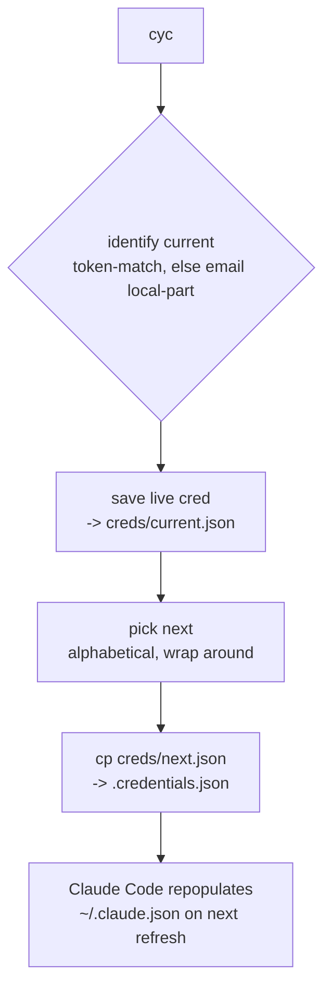

# zim-claude

A zsh module that rotates the [Claude Code](https://docs.claude.com/en/docs/claude-code) CLI account — `~/.claude/.credentials.json` — across multiple OAuth accounts, for machines that share several Claude Pro/Max logins.

## Commands

| command | action |
|---|---|
| `cyc` | rotate to the next account (alphabetical), saving the current one first |
| `cyc <name>` | switch to a specific account (handle, unique prefix, or full email) |
| `cycLs` | list accounts; `*` marks current, shows subscription tier + token expiry |
| `cycImport` | seed the store from legacy `~/.claude/cred-*.json` plus the live credential |

## Architecture

### Data model — the files are the database

Each account is one file named by the email **local-part** — the stable, human-friendly key Claude exposes in `~/.claude.json` (e.g. `buckaroo@yoyodyne.example.net` → `buckaroo.json`):

```
~/.claude/creds/
  buckaroo.json     # { claudeAiOauth: { accessToken, refreshToken, expiresAt, scopes, ... } }
  penny.json
  rawhide.json
```

No registry, no sidecar. A switch is a `cp` of one file over `~/.claude/.credentials.json`.

### Why copy, not symlink

Claude Code writes `.credentials.json` with an **atomic temp-file + rename**. A symlinked `.credentials.json -> cred-X.json` is *replaced by a regular file* on that write, so the freshly-rotated refresh token lands in `.credentials.json` and never reaches the backing `cred-X.json`. Cycling back then re-points at a stale, server-invalidated refresh token — the account "dies" on return. Copying removes the failure mode entirely.

### Current-account detection — two-prong, no marker file

`_cyc_current` answers "which account is live?" without any state of its own:

1. **Token match** — read the live `refreshToken`, find the store file with the same value. Succeeds when no refresh has occurred since the last switch (covers a second `cyc` before Claude Code runs).
2. **Email fallback** — read `oauthAccount.emailAddress` from `~/.claude.json`, take its local-part. Succeeds after Claude Code has refreshed, because it updates `~/.claude.json` itself when the live token has rotated away from every stored file.

The paths are complementary: token-match wins exactly when the email is stale, and vice versa.

### Save-before-switch

Every `cyc` copies the **outgoing** account's live credential back into its store file *before* overwriting, so a token Claude just refreshed is never lost. A trailing ` *` in the output marks when the saved copy actually differed (a refresh was captured).

### Identity is implicit

`.credentials.json` carries no account identifier, and Claude Code repopulates `~/.claude.json`'s `oauthAccount` itself via its profile endpoint on token refresh — so we neither store nor restore an identity slice. Identity is read live when needed; everything else is left for Claude to maintain.

### Switch flow



## Wiring

Sourced from `~/.config/zsh/conf.d/zim-claude.conf`, a symlink to [`zim-claude.zsh`](zim-claude.zsh) — the user `conf.d` loop auto-sources `*.conf`. Override the store location with `CLAUDE_CREDS_DIR`.
